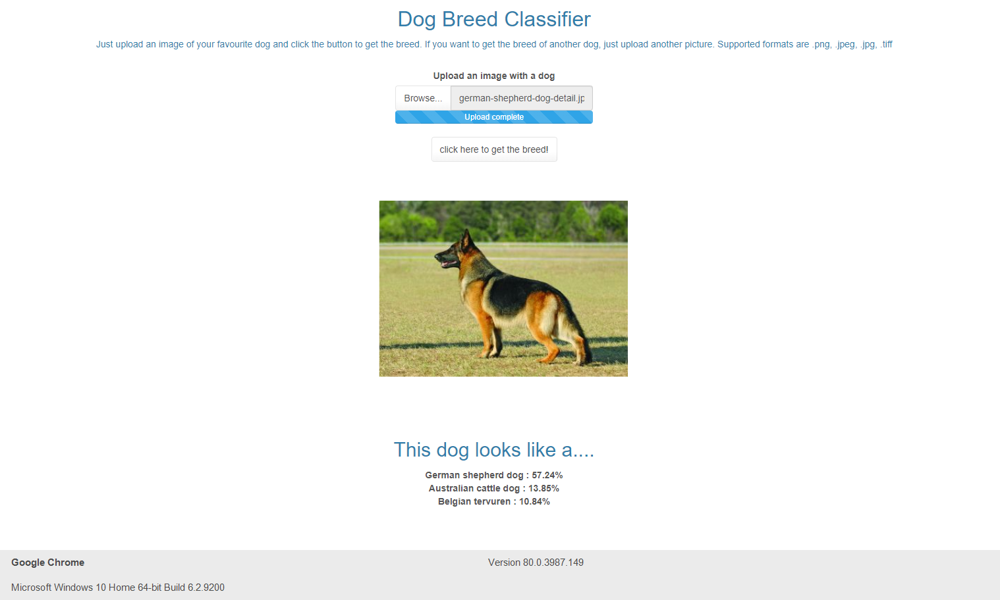
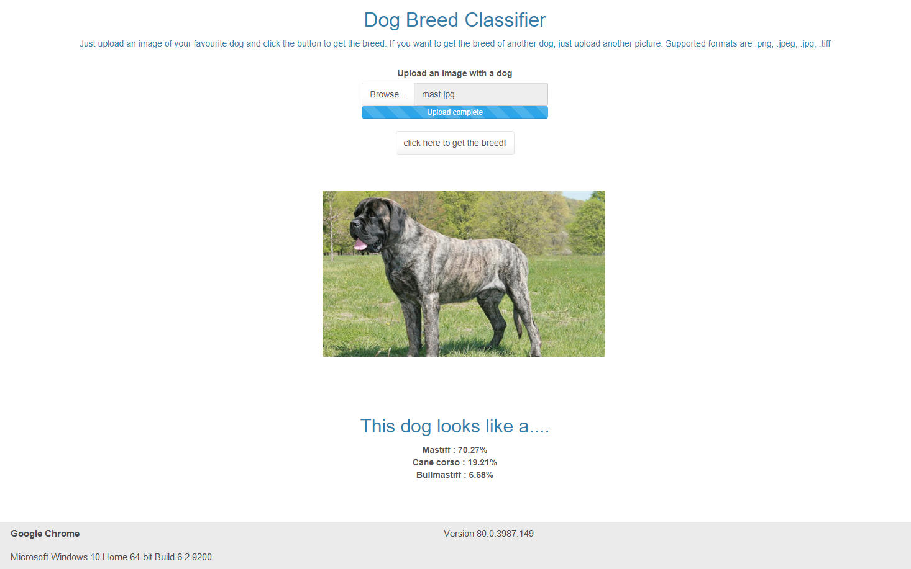

# Dog-Breed-Classifier-with-Shiny-App-Deployment
Background Code behind my deployed R Shiny app located at https://thalamus.shinyapps.io/Dog_Classifier_Deployment/
containing a dog breed classifier built using transfer learning in PyTorch . A couple examples of how this app works can be seen below:

