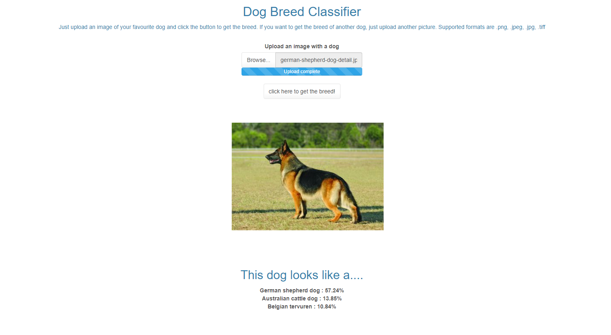
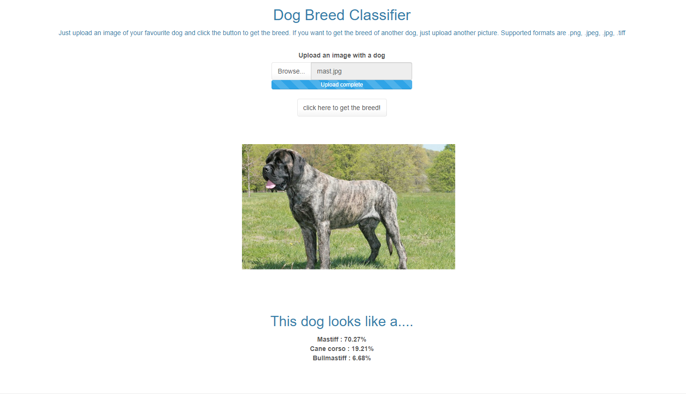

# Dog-Breed-Classifier-with-Shiny-App-Deployment
Background Code behind my deployed R Shiny app located at https://thalamus.shinyapps.io/Dog_Classifier_Deployment/
containing a dog breed classifier built using transfer learning in PyTorch. This model yielded a classification accuracy of 83% in the test set. 

The functioning of the app is very straighforward. Simply upload an image with a dog (Supported formats are .png, .jpeg, .jpg, .tiff) and then click the button to get the top 3 most likley breeds. This procedure can be done multiple times with multiple pictures. A couple examples of how this app works can be seen below:

The first folder above represents the orginal code that I used to build and test the app locally in my computer. This includes the script were I trained and tested the model. As mentioned, the underlying model is built using transfer learning. It is based on ResNet50, but has custom fully-connected layers at the end to adapt it to the purpose of dog breed classification. Thus, the code to instantiate the model is as follows:

    # Instantiate the model
    # Specify model architecture 
    # Import the pretrained version of ResNet 50
    model_transfer = models.resnet50(pretrained=True)

    for param in model_transfer.parameters():
        param.requires_grad = False
    
    # Modify the last fully connected layar to make it relevant to the new training dataset
    classifier = nn.Sequential(OrderedDict([
                          ('h1',nn.Linear(2048,1024)),
                          ('relu1', nn.ReLU()), 
                          ('drop1',nn.Dropout(0.2)),
                          ('h2', nn.Linear(1024, 512)),
                          ('relu2', nn.ReLU()),
                          ('drop2',nn.Dropout(0.2)),
                          ('h3', nn.Linear(512, 133)),
                          ('output', nn.LogSoftmax(dim=1))
                          ]))
    model_transfer.fc = classifier
    
    # Load best model
    model_transfer.load_state_dict(torch.load(best_model))

The best model as well as the data used can be obtained from https://drive.google.com/drive/folders/1ocUDVNVijF5j5Z4ysC8X-XE-X3JHpTwz  

The second folder contains the code which I used to actually deploy the R Shiny app in www.shinyapps.io

Please be advised, it may take a few seconds for the Shiny app to load once you click on the URL above, and to give the first prediction once you upload a picture. If anyone notices any errors, please let me know, so I can fix them. It would be much appreciated!
